<div align="center">

# CyberLife

### 极深以溯源，研几以知微

<p>
  <em>一处以深色星空为骨，以水墨留白为神的术数工作台。</em>
</p>

<p>
  
</p>

<p>
  
  
  
  
</p>

</div>

> 「留白不是空，乃是意境的延伸；墨分五色，方见层次与气韵。」

CyberLife 是一个以中国传统术数为主题的现代 Web 产品。它并不追求夸张神秘感，而是将 **深色、星空、iOS 式克制界面** 与 **水墨、宣纸肌理、东方留白** 融合，做成一套真正可交互、可扩展、可继续演进的术数工作台。

当前项目遵循 [DESIGN.md](./DESIGN.md) 的审美母题，并已落地为一版融合式视觉语言：  
**深色为底，八卦旋转为首页主视觉，水墨作为界面气质，而不是喧宾夺主的装饰。**

---

## 视觉方向

### 气质关键词

- 深色
- 宁静
- 星空
- 水墨
- 留白
- 轻毛玻璃
- iOS inspired
- 现代产品感

### 设计转译

本项目没有把 `DESIGN.md` 生硬翻译成纯宣纸古风页面，而是采用混合方案：

- 保留首页持续缓慢旋转的八卦阵作为主视觉
- 保留现代产品导航、表单、状态反馈与工具页结构
- 将水墨中的「焦、浓、重、淡、清」转译成界面的明暗层次
- 用朱砂、淡金、墨褐取代单一冷蓝高光
- 用纸纹、墨晕、留白增强东方气韵

---

## 模块规划

| 模块 | 当前阶段 | 状态 |
| --- | --- | --- |
| 六爻 | MVP 已打通 | 已完成输入、API、引擎、解释层、结果页 |
| 梅花易数 | 第二核心模块 | 已有输入页、API、引擎、解释层与正式盘面结果 |
| 八卦 | 占位模块 | 待后续实现 |
| 大六壬 | 占位模块 | 待后续实现 |
| 紫微斗数 | 占位模块 | 待后续实现 |

---

## 当前能力

### 六爻

- `/api/divination/liuyao` Typed POST API
- 手动输入 / 系统生成双模式
- 六爻结构录入、动爻判断、本卦变卦输出
- 宫位、世应、六亲、六神等结构化字段
- 独立 interpretation layer
- 墨色风格结果页与盘式预览

### 梅花易数

- `/api/divination/meihua` Typed POST API
- 时间起卦 / 数字起卦双模式
- 本卦、互卦、变卦、体卦、用卦、动爻输出
- 更接近传统数法的时间取数：
  - 农历月
  - 农历日
  - 年支数
  - 时辰数
- 断语层级：
  - 上吉
  - 吉
  - 可成
  - 先难后易
  - 谨慎

---

## 技术栈

- Next.js 16
- React 19
- TypeScript
- Tailwind CSS 4
- Ant Design
- `element-china-area-data`

---

## 目录结构

```text
app/                       App Router pages and API routes
components/                Shared UI, layout, page, and module components
content/interpretations/   Module interpretation layers
engines/                   Divination engines
schemas/                   Shared typed schemas
public/                    Static assets, including README visuals
```

---

## 核心架构

项目按三层拆分：

### 1. UI Layer

- 页面与组件只负责交互、展示、状态切换
- 不把计算逻辑写进 `page.tsx`

### 2. Engine Layer

- 所有术数运算逻辑放在 `engines/`
- 可被 API 和未来其它前端入口复用

### 3. Interpretation Layer

- 独立于引擎
- 负责将结构化 chart 翻译成现代、克制的断语与分项解读

---

## 运行方式

安装依赖：

```bash
npm install
```

本地开发：

```bash
npm run dev
```

质量检查：

```bash
npm run lint
npm run typecheck
npm run build
```

---

## 路由

- `/` 首页
- `/liuyao` 六爻
- `/meihua` 梅花易数
- `/bagua` 八卦占位页
- `/daliuren` 大六壬占位页
- `/ziwei` 紫微斗数占位页

---

## 设计文件

- [DESIGN.md](./DESIGN.md)  
  水墨美学母题与字体、色彩、留白、意境方向

- [UI-REDESIGN-PLAN.md](./UI-REDESIGN-PLAN.md)  
  将 `DESIGN.md` 转译为当前产品可执行的融合版 UI 重构方案

- [PLANS.md](./PLANS.md)  
  项目执行进度与阶段计划

---

## 当前阶段

项目现在已经不再是单纯骨架阶段，而是：

1. 网站骨架完成
2. 首页与全站导航完成
3. 六爻 MVP 已完整打通
4. 梅花易数已进入可交互、可起卦、可解释阶段
5. 全站正在沿 `DESIGN.md` 方向持续推进视觉统一

---

## 说明

本项目用于中国传统术数的文化研究、产品设计与工程实现探索。  
页面中的结果与断语仅供学习、研究与参考，不构成现实世界决策建议。
